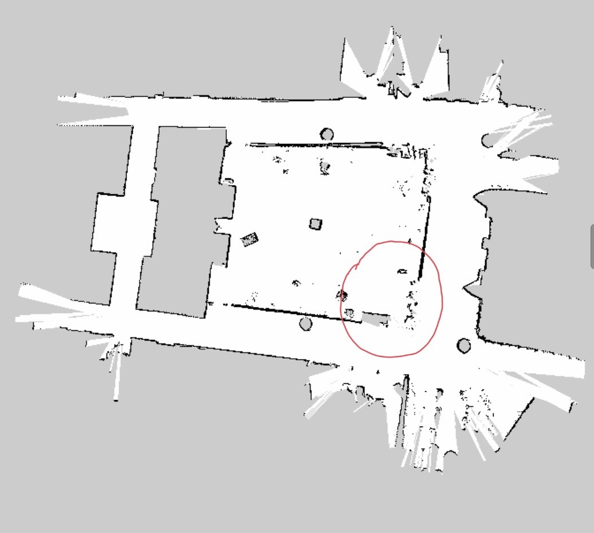
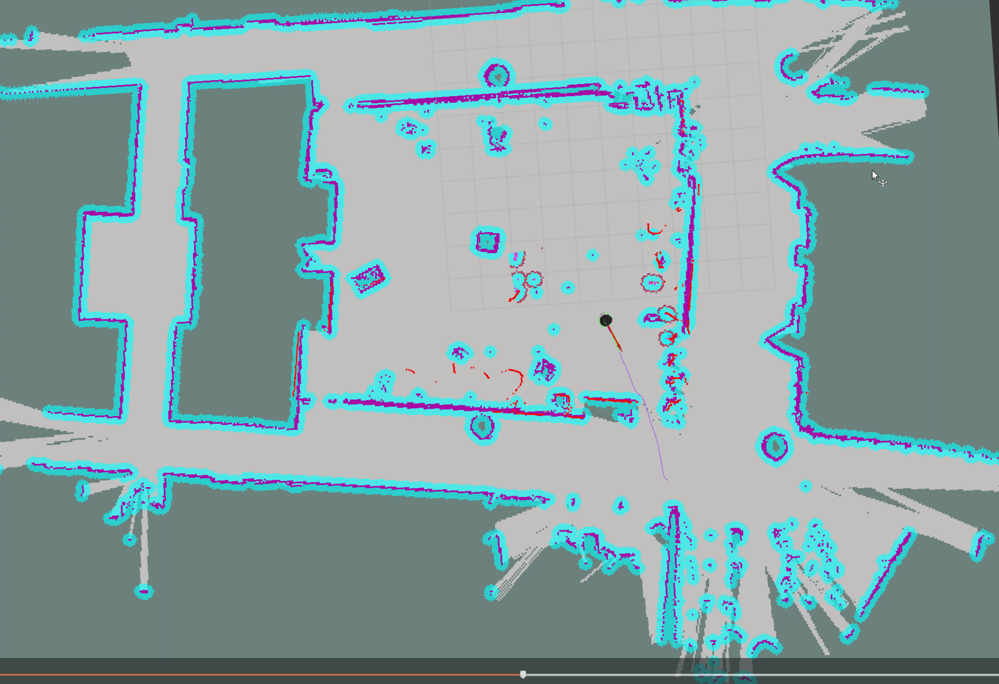
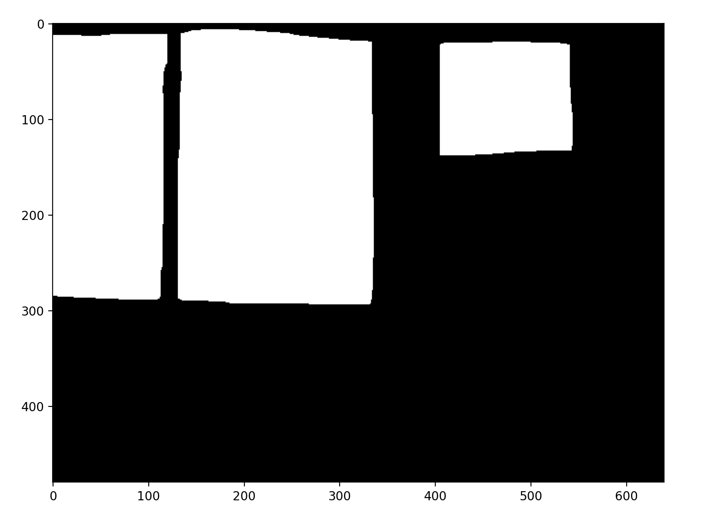
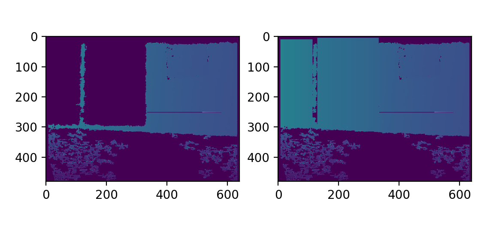
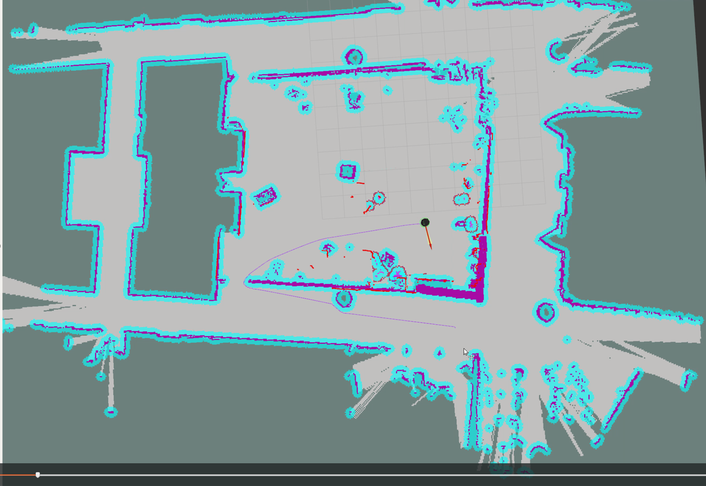

# Long-term Autonomy in the Iribe Glass Hallway
Author: Jingxi Chen (<ianchen@terpmail.umd.edu>)

**Testing Environment:**  
The glass hallway in the [Iribe building](https://iribe.umd.edu/#firstPage)' glass hallway at University of Maryland.  
The reason we choose this real-world environment is mainly because ***This environment is not designed to be robot-friendly*** 
 

 
 
 
 
The potential research problems/difficulties for mobile robotics: 
* The **glass wall** in the hallway 
* This environment is **highly dynamic** (the location of many objects in the evironment can be changed throughout the time)
* There are **human** involved in this environment (people walking around)

## Part 1: Building and testing the research platform

### 1. The robot
The first step for this project is to select and test a reasonable research platform (mobile robot) that fits to 
our research purpose. 

Our major considerations are: 
* It is compatible with ROS
* Low-cost with reasonable functionality (after some upgrade)
* Medium size 

Based on these criteria, we selected TurtleBot 2 as our base platform. 
 
 
To setup TB2, please see the documentation:  [Setup TB2](https://github.com/codingrex/Long-Term-Autonomy/blob/main/tb2_setup/SETUP_TB2.md) 

### 2. The ROS-based autonomy/navigation stack
Our ROS-based Navigation stack includes following components:
* Perception
* SLAM 
* Motion planning

After fine-tuning and modifications, here are the examples of effect of three
components:  
####  Perception:  
Converting static map (after mapping) and dynamic sensor observations in to 
global and local costmaps (used for later global and local planning)

 

#### SLAM:  
Mapping of our lab + the surrounding hallway environment:

 

Particle-filter based localization during autonomous run:
 
 
 #### Motion Planning   
 Motion Planning stack involves two-level of planning: global planning (plan a path from a to b on global scale) and 
 local planning (path following and collision avoidance)
 
 

 

## Part 2: The problem of glasswall in navigation 
The problem that glasswall will impose during the autonomous navigation is that robot cannot detect it using the Lidar or Depth camera and thus will 
plan a path that collide with the glasswall. 
* The depth image of 3D camera cannot correctly measure and detect glasswall (will penetrate and ignore glass wall)  
 

 **RGB image when robot facing the glass wall**
 
 

  
 
 **The depth image**
 
 
 
 
*  The Lidar will face similar problems with glassway and we can see it from the following map generated by
Lidar-based gmapping  
 
 
**After mapping, the glassway in red circle is missing in static map generated**

 
 

* This will result in planner generate a false path that bump into the glasswall 

For example, in this case we send robot a goal pose that goes out of our lab into the hallway, the planner will view 
the missing glasswall as free space and plan a path through it correspondingly. (will result in robot bump into the glasswall)

 **The planned path and costmaps**
 
   
 
  
 
 
 
 ## Part 3: Unifying the geometry and semantics of glasswall
 
 The robot plans path based on the costmaps which are from the sensor measurements (Lidar scan, Depth images). In this way, 
 we essentially use ray-tracing for endpoints in order to perceive and represent the world. This way of using only geometry to
 represent the world makes it difficult to deal with the glasswall (invisible to ray-tracing).
 
 To address this, we are going to incorporate the semantic understanding of environment (from RGB images) into the geometric
 measurement for detecting and representing the glasswall such that we can improve our autonomous navigation.
 
  
  **RGB image when robot facing the glass wall**
     
  

  
 
 * Training a semantic segmentation network which using the surrounding context to generate segmentation mask for glasswall 
 
   **The glasswall segmentation mask from our trained model**
     
  

  
 
 
  * Using the resulting segmentation mask to correct the depth image
 
   **On the left is original depth image, on the right is the corrected one**
     
  

  
 
 
 * Using this idea we can correctly perceive and represent glasswall 
 thus improve the autonomous navigation of the robot (robot can plan a collision-free path
 out of room that take into account of glasswall)
 
 **The new planned path and costmaps**
     
  

  
 
 
 
 
  ## Summary:
  This ongoing research project on real robot is an example of my research interest **on the intersection of Vision and Robotics of using
  semantic understanding to improve the robot autonomy**. From this experience, I learned and sharpened skills and understandings in
  Autonomy stack (Perception, SLAM, Motion Planning) of robots, the visual learning and recognition
  , I also gained more understandings in the challenges for real-robot based problems. 
 
 
 

