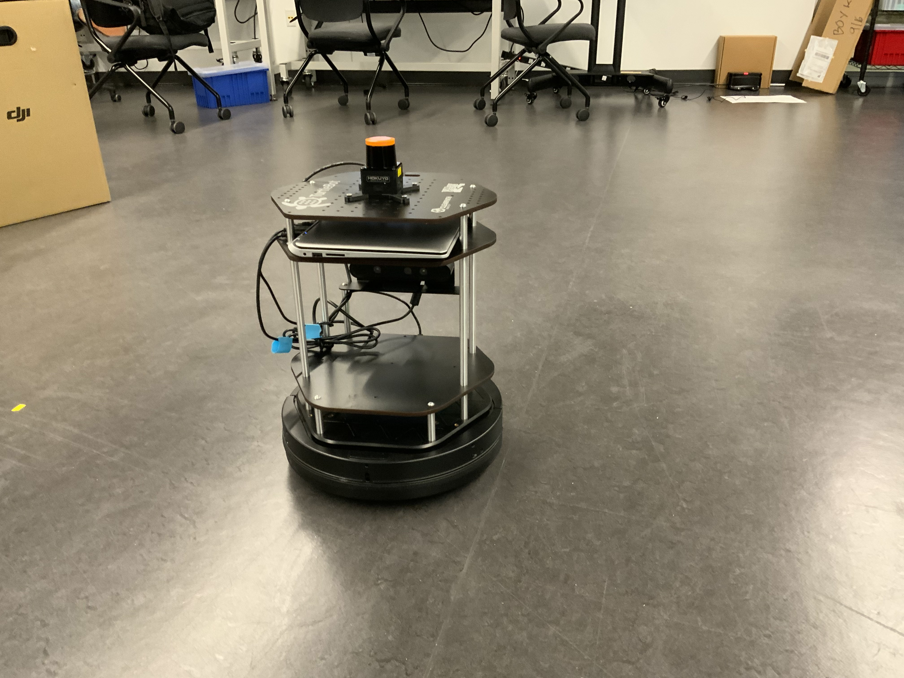
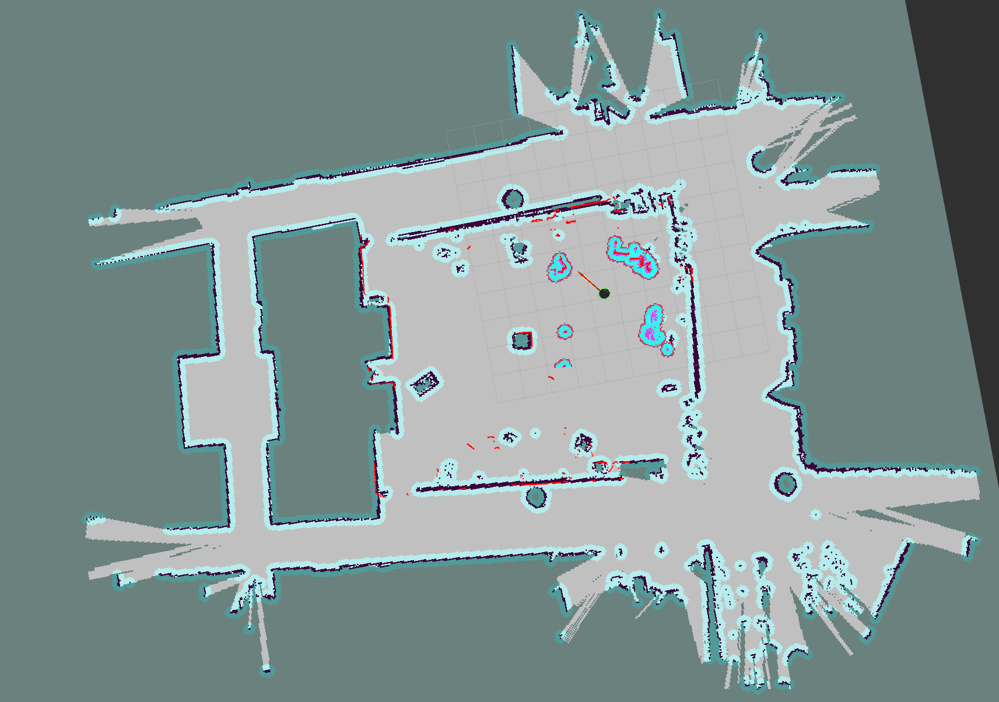
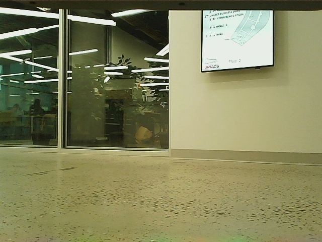
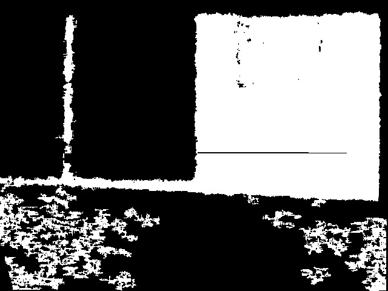

# Long-term Autonomy in the Iribe Glass Hallway
Author: Jingxi Chen (<ianchen@terpmail.umd.edu>)

**Testing Environment:**  
The glass hallway in the [Iribe building](https://iribe.umd.edu/#firstPage)' glass hallway at University of Maryland.  
The reason we choose this real-world environment is mainly because ***This environment is not designed to be robot-friendly*** 
 

 
 
 
 
The potential research problems/difficulties for mobile robotics: 
* The **glass wall** in the hallway 
* This environment is **highly dynamic** (the location of many objects in the evironment can be changed throughout the time)
* There are **human** involved in this environment (people walking around)

## Step 1: Building and testing the research platform

### 1. The robot
The first step for this project is to select and test a reasonable research platform (mobile robot) that fits to 
our research purpose. 

Our major considerations are: 
* It is compatible with ROS
* Low-cost with reasonable functionality (after some upgrade)
* Medium size 

Based on these criteria, we selected TurtleBot 2 as our base platform. 
 
 
To setup TB2, please see the documentation:  [Setup TB2](https://github.com/codingrex/Long-Term-Autonomy/blob/main/tb2_setup/SETUP_TB2.md) 

### 2. The ROS-based autonomy/navigation stack
Our ROS-based Navigation stack includes following components:
* Perception
* SLAM 
* Motion planning

After fine-tuning and modifications, here are the examples of effect of three
components:  
####  Perception:  
Converting static map (after mapping) and dynamic sensor observations in to 
global and local costmaps (used for later global and local planning)

 

#### SLAM:  
Mapping of our lab + the surrounding hallway environment:

 

Particle-filter based localization during autonomous run:
 
 
 #### Motion Planning   
 Motion Planning stack involves two-level of planning: global planning (plan a path from a to b on global scale) and 
 local planning (path following and collision avoidance)
 
 

 

## Step 2: Resolving the glassway problems for navigation 
The problem that glasswall will impose during the autonomous navigation is that robot cannot detect it using the Lidar or Depth camera and thus will 
plan a path that collide with the glasswall. 
* The depth image of 3D camera cannot correctly measure and detect glasswall (will penetrate and ignore glass wall)  
 

 *When robot facing the glass wall*
 

  
 
 *The depth image*
 

 
 
 

