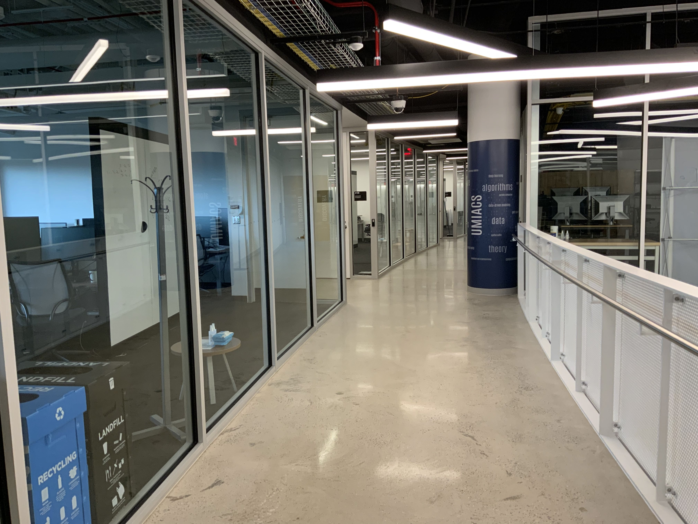
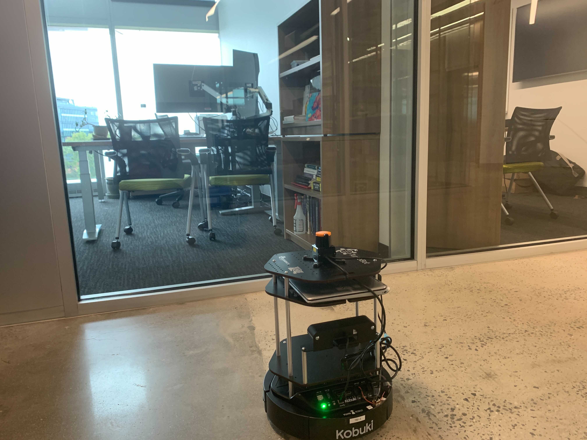
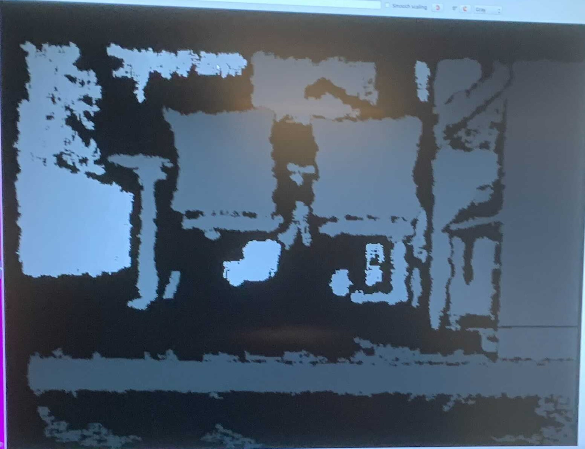

# Long-term Autonomy in the Iribe Glass Hallway
Author: Jingxi Chen (<ianchen@terpmail.umd.edu>)

The goal of this long-term autonomy project is to explore and solve some real-world mobile robotics problems 
(in Perception, SLAM, Planning). 

**Testing Environment:**  
The glass hallway in the [Iribe building](https://iribe.umd.edu/#firstPage)' glass hallway at University of Maryland.  
The reason we choose this real-world environment is mainly because ***This environment is not designed to be robot-friendly*** 
 

 
 
The potential research problems/difficulties for mobile robotics: 
* The **glass wall** in the hallway 
* This environment is **highly dynamic** (the location of many objects in the evironment can be changed throughout the time)
* There are **human** involved in this environment (people walking around)

## Step 1: Building and testing the research platform

### 1. The robot
The first step for this project is to select and test a reasonable research platform (mobile robot) that fits to 
our research purpose. 

Our major considerations are: 
* It is compatible with ROS
* Low-cost with reasonable functionality (after some upgrade)
* Medium size 

Based on these criteria, we selected TurtleBot 2 as our base platform. 
 
 
To setup TB2, please see the documentation:  [Setup TB2](https://github.com/codingrex/Long-Term-Autonomy/blob/main/tb2_setup/SETUP_TB2.md) 

### 2. The ROS-based autonomy/navigation stack
Our ROS-based Navigation stack includes following components:
* Perception Stack
* SLAM 
* Motion planning Stack

After fine-tuning and modifications:  
These are the examples of effect of three components:

## Step 2: Testing our prototype research platform in Iribe's hallway
* As we expect, the depth image of 3D camera cannot correctly measure the depth of glass wall (will penetrate and ignore glass wall)  
 
 
 *When robot facing the glass wall*
  
 
 *The depth image*
 
 As we can see, in the depth image it ignores the glass wall and directly measure the depth of the chairs behind the glass wall.
 

