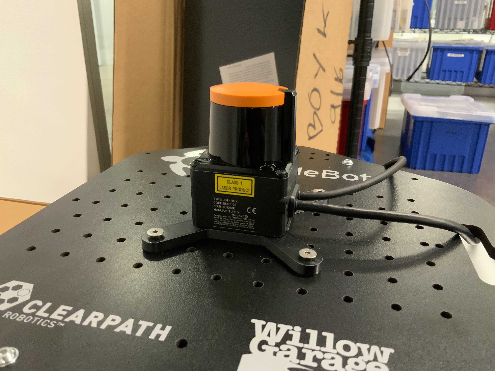
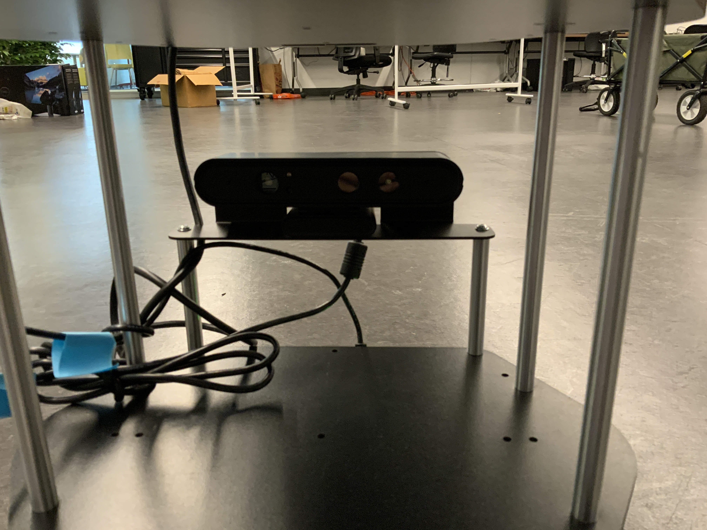

# Setting up TurtbleBot 2
Author: Jingxi Chen (<ianchen@terpmail.umd.edu>)

This document is for setting up the TurtleBot 2 based research platform. 


**Current Sensors:** <br />
The current sensors on our TurtleBot 2 are: 
* HOKUYO UST-10LX Lidar 

 

<br />

* ORBBEC Astra 3D Camera (RGB image, Depth image) 

 
 
## Software Dependencies: 
The official TurtleBot 2 packages are best compatible with **ROS Kinetic**
The following are minimum system requirement:
* Ubuntu version: Ubuntu 16.04 LTS
* ROS version: ROS kinetic
* Packages: [Basic Packages](http://irvlab.cs.umn.edu/turtlebot2/turtlebot-wiki)  

## 1. Connect to TurtleBot 2: 
Connect to the same network TB2 \
SSH into TB2

For example:

```
ssh TB@192.168.**.***
```

## 2. Start ROS on your computer: 
Start roscore on your computer
```
roscore
```

## 3. Bring up TurtleBot 2: 
Start up TB2 and the desired sensors on **TB2's laptop**

For example: 

Bring up TB2 with minimum functionality 
```
roslaunch turtlebot_bringup minimal.launch
```

Bring up TB2's 3D camera 
```
roslaunch astra_launch astra.launch
```

## 4. Teleoperate TB2: 
Use keyboard or PS3 joystick to manually control TB2

For example: 

```
roslaunch turtlebot_teleop ****.launch
```

## 5. Navigation Stack: 
The way of running a standard Navigation task is similar to following process:

1. Mapping the environment: \
Will get a map of the environment after this step. 

2. Navigating in the environment \
The process can be viewed as following: 1) Provide the map (from previous step). 2) Add in Localization stack. 3) Add Motion Planning stack (Local, Global Planners)


